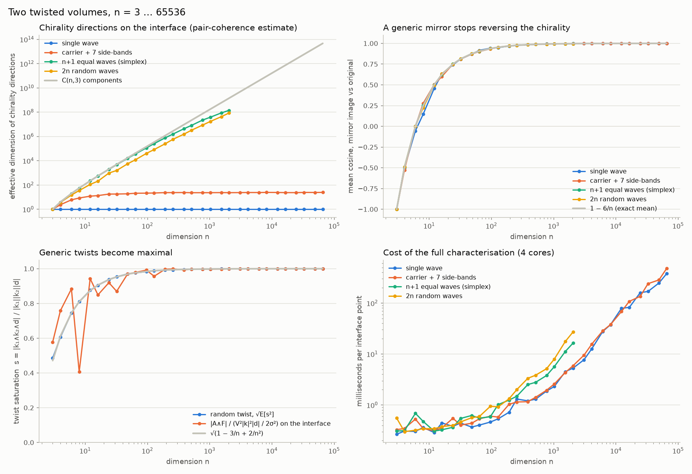
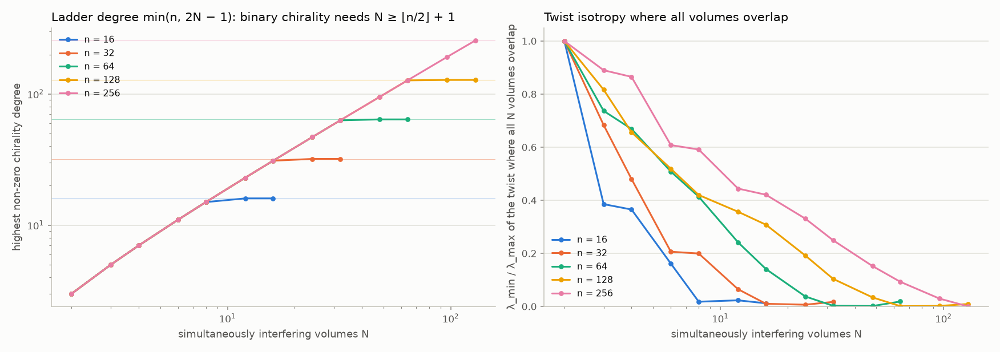
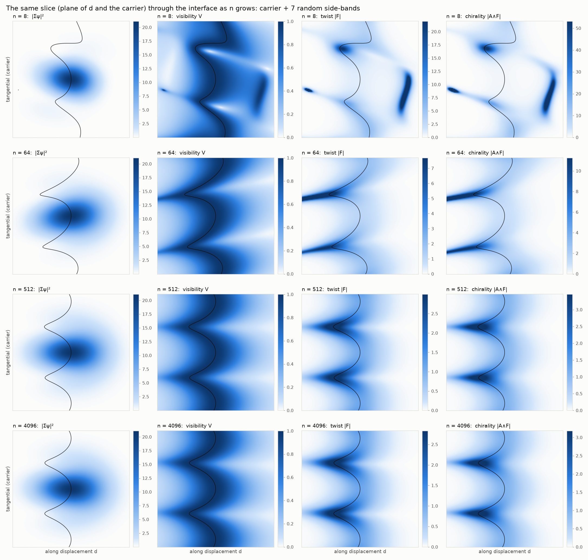
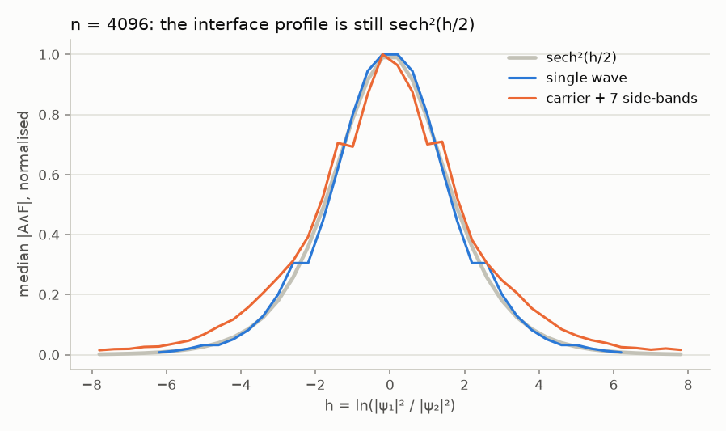

# twistchiral — twist-chirality interfaces of interfering n-dimensional wave volumes

A small NumPy/SciPy/Matplotlib library, a test suite, and a set of numerical
experiments built to examine one hypothesis:

> *When two high-dimensional wave-interference "volumes" meet, the interface
> between them carries a twist-chirality structure that is itself
> high-dimensional rather than a binary (left/right) chirality.*

The short answer, worked out below and verified numerically, is **yes, with a
precise meaning**: the natural twist-chirality of an interference interface in
$n$ dimensions is a differential form of degree $\min(n,\,2N-1)$, where $N$ is
the number of volumes interfering *simultaneously*. It is a pseudoscalar (a
binary sign) only when that degree reaches $n$. For two volumes in $n\ge 4$
it is an oriented 3-plane with a magnitude, i.e. a direction-valued chirality;
in 4-D it is literally a tangent vector field on the 3-dimensional interface.
Binary chirality in $n$ dimensions needs at least $\lfloor n/2\rfloor + 1$
simultaneous volumes.

All figures below live in `figures/`, all numbers in `results/*.json`, and
every closed-form statement is checked by `tests/` (64 tests). Section 6
extends everything generically to arbitrary dimension and runs it to
$n = 65\,536$.

---

## 1. The framework

### 1.1 Volumes

A *wave volume* is a localised superposition of plane waves,

$$\psi_a(x,t)=G_a(x-x_a-v_a t)\sum_m c_{am}\,e^{\,i(k_{am}\cdot x-\omega_{am}t)},\qquad x\in\mathbb R^n ,$$

with a Gaussian envelope $G_a$ (the "volume"), a *wavevector set*
$\{k_{am}\}$ drawn from a geometric configuration (simplex, cross-polytope,
hypercube, planar ring, random), complex amplitudes, and an optional
dispersion relation. Everything, including gradients, is evaluated analytically.
The second volume of a pair is typically a *twisted* copy of the first: rotated
by an element of $\mathrm{SO}(n)$ — which in $n$ dimensions rotates in up to
$\lfloor n/2\rfloor$ orthogonal planes at once — and displaced by $d$. The pair
$(R,d)$ is an $n$-dimensional **screw**.

### 1.2 Why the naive helicity is useless, and what replaces it

The obvious 3-D notion of twist-chirality of a wave is the helicity of its
current, $J\cdot(\nabla\times J)$ with $J=\mathrm{Im}(\psi^*\nabla\psi)$. For a
single complex scalar field this vanishes **identically** in every dimension:
$J=|\psi|^2\nabla\varphi$ is hypersurface-orthogonal, so $J\wedge dJ=0$. The
summed field $\psi_1+\psi_2$ is again one scalar, so its current has no
chirality either. Chirality has to be looked for in the *relative* structure of
the interfering volumes, not in the total field.

The library therefore keeps the volumes' identities and treats the $N$ fields as
one spinor $\Psi(x)=(\psi_1,\dots,\psi_N)\in\mathbb C^N$. Its projective class
$[\Psi(x)]\in\mathbb{CP}^{N-1}$ is exactly the interference data — the relative
amplitudes and relative phases at $x$ — and is blind to the overall amplitude
and phase. For $N=2$ this is the Bloch sphere: the azimuth is the fringe phase
$\varphi_2-\varphi_1$, the polar angle is set by the amplitude ratio, and the
**interface** $|\psi_1|=|\psi_2|$ is the pre-image of the equator, the surface on
which the fringe visibility $V=2A_1A_2/(A_1^2+A_2^2)$ equals one.

Pulling the Fubini–Study geometry of $\mathbb{CP}^{N-1}$ back to $\mathbb R^n$
gives, with $\rho=|\Psi|^2$ and $P_\perp=1-\Psi\Psi^\dagger/\rho$,

$$A_i=\frac{\mathrm{Im}(\Psi^\dagger\partial_i\Psi)}{\rho}
=\sum_a\frac{\rho_a}{\rho}\,k_{a,i}(x),\qquad
Q_{ij}=\frac{\partial_i\Psi^\dagger P_\perp\partial_j\Psi}{\rho},\qquad
g=\mathrm{Re}\,Q,\qquad F=2\,\mathrm{Im}\,Q=dA .$$

* $A$ (Berry connection) is the intensity-weighted mean local wavevector.
* $g$ (quantum metric) measures how fast the interference texture changes.
* $F$ (Berry curvature) is the **twist**: an antisymmetric matrix field, i.e. a
  2-form, whose eigen-structure is a set of rotation planes with rates.

### 1.3 The chirality ladder

From $A$ and $F$ one builds the Chern–Simons / Chern forms

$$A,\quad F,\quad A\wedge F,\quad F\wedge F,\quad A\wedge F\wedge F,\quad\dots$$

of degrees $1,2,3,4,5,\dots$ The degree-$p$ rung is an oriented $p$-volume
element at every point. Only when $p=n$ is it a pseudoscalar (a binary sign);
for $p<n$ its Hodge dual is an $(n-p)$-form, a genuinely multi-component,
direction-valued chirality. In three dimensions $A\wedge F$ is the familiar
helicity/Hopf density and is a sign; in four it is dual to a vector.

Because $F$ is pulled back from a space of real dimension $2(N-1)$, its rank is
at most $2(N-1)$. Hence

**Ladder theorem.** *The degree-$p$ rung of $N$ simultaneously interfering
volumes in $\mathbb R^n$ is generically non-zero iff $p\le\min(n,\,2N-1)$.
Chirality is binary (a pseudoscalar) iff $N\ge\lfloor n/2\rfloor+1$.*

Verified for every $n\in\{3,\dots,8\}$, $N\in\{2,\dots,6\}$
(`figures/D_chirality_ladder.png`, `tests/test_qgt.py::test_ladder_ends_at_predicted_degree`).


---

## 2. Two volumes: what the interface looks like

### 2.1 Closed forms (exact, verified to $10^{-15}$)

Write $\psi_a=A_a e^{i\varphi_a}$, local wavevectors $k_a=\nabla\varphi_a$,
$h=\ln(|\psi_1|^2/|\psi_2|^2)$ (so the interface is $h=0$) and
$V=\operatorname{sech}(h/2)$. Then, everywhere both fields are non-zero,

$$F=\tfrac12 V^2\;\nabla\ln\!\frac{A_2}{A_1}\wedge(k_2-k_1),\qquad
A\wedge F=\tfrac12 V^2\;k_1\wedge k_2\wedge\nabla\ln\!\frac{A_1}{A_2}.$$

So the **twist plane** is spanned by the interface normal and the fringe
wavevector, and the **chirality 3-vector** is the oriented volume spanned by the
two local wavevectors and the interface normal, weighted by the square of the
fringe visibility. For two single-plane-wave Gaussian volumes of equal width
$\sigma$ this becomes

$$A\wedge F=-\frac{V^2}{2\sigma^2}\,(k_1\wedge k_2)\wedge d ,$$

i.e. (up to the orientation convention of the Berry curvature) the **screw
chirality** $(\log R)\wedge d$ of the configuration: rotate $k_1$ into $k_2$
while advancing along $d$. In 3-D this is the triple product $k_1\cdot(k_2\times d)$,
a sign; in $n\ge4$ it is a decomposable 3-vector, an oriented 3-plane in
$\mathbb R^n$ with a magnitude.

### 2.2 Invariances of the interface

* **Relative phase.** Shifting the phase of one volume moves every fringe but
  leaves $F$ and $A\wedge F$ *exactly* unchanged (measured $10^{-14}$, while the
  intensity pattern changes by ~100 %). The twist-chirality is a property of
  the fringe *geometry*, not of where the fringes sit.
* **Time.** For monochromatic volumes (one frequency each) the whole structure is
  stationary while the fringes stream through it; it evolves only for
  polychromatic volumes or moving envelopes.
* **Flux quantum.** The flux of $F$ through any strip crossing the interface and
  spanning one fringe period is exactly $2\pi$ (half the Bloch sphere).
* **Localisation.** Both $|F|$ and $|A\wedge F|$ follow $\operatorname{sech}^2(h/2)$
  across the interface (measured correlation 0.98); in real space the interface
  has thickness $\sim\sigma^2/|d|$.


### 2.3 Three dimensions: signed chirality domains on the wall

On the interface, with unit normal $\hat n$ and tangential wavevector
components $k^T_a$, the chirality is $\tfrac12 V^2|\nabla\ln(A_1/A_2)|\;\hat n\wedge k_1^T\wedge k_2^T$.
In 3-D the tangential bivector $k_1^T\wedge k_2^T$ is a sign, so the wall is
tiled by **right- and left-handed domains** separated by curves on which the two
tangential wavevectors are parallel (sign predicted correctly at 100 % of
sampled points).

Two regimes appear:

* *Weakly structured volumes* (a carrier with weak side-bands): one gently wavy
  wall; the screw handedness dominates (82 % of the wall has the screw's sign)
  with small islands of the opposite hand.
* *Strongly structured volumes* (several equal waves): the wall is decorated
  with thin **vortex tubes** around the phase singularities of each volume,
  the domains are balanced (53 / 47 %), and twist and chirality are strongly
  concentrated on the tubes.


### 2.4 Four dimensions: chirality becomes a direction field

In $n=4$ the Hodge dual $\star(A\wedge F)$ is a vector, and it is **tangent to
the 3-dimensional interface** (measured normal component $10^{-16}$): the
chirality of the interface is a tangent vector field — the axis about which the
tangential wavevector plane turns — not a sign.

* A single-wave pair has a *constant* chirality direction (effective dimension
  1.00) equal to the screw prediction (error $2\times10^{-15}$).
* Structured pairs spread their chirality directions over 2.4 (carrier +
  side-bands), 2.9 (8 random waves) and 3.8 (5 equal waves) of the 4 available
  components.
* A **mirror image** negates the chirality in 3-D (all direction cosines
  exactly $-1$) but merely *rotates* it in 4-D (mean cosine $-0.50$, only 3 %
  of points negated).


The magnitude of the chirality as a function of the two twist angles of a 4-D
rotation is a smooth landscape with zero lines for the single-wave pair,
$|A\wedge F|=|k_1\wedge R(\alpha_1,\alpha_2)k_1\wedge d|/2\sigma^2$; with
internal structure the landscape is reshaped by the side-bands
(`figures/B_two_volumes_4d_twist_sweep.png`).

### 2.5 Dimension sweep

Effective dimension (participation ratio of the second-moment spectrum) of the
unit chirality 3-vectors sampled on the interface:

| n | components $\binom n3$ | single wave | carrier + side-bands | n+1 equal waves | 2n random waves |
|---|---|---|---|---|---|
| 3 | 1 | 1.0 | 1.0 | 1.0 | 1.0 |
| 4 | 4 | 1.0 | 2.4 | 3.7 | 3.0 |
| 5 | 10 | 1.0 | 4.4 | 8.6 | 5.4 |
| 6 | 20 | 1.0 | 4.8 | 16.7 | 11.5 |
| 7 | 35 | 1.0 | 10.2 | 25.9 | 17.1 |
| 8 | 56 | 1.0 | 10.9 | 36.9 | 26.8 |

Structureless volumes always produce a single oriented 3-plane; internal wave
structure spreads the chirality over an ever larger space as $n$ grows. (The
participation ratio measures linear spread; the decomposable 3-vectors of a
pair lie on a cone of intrinsic dimension $3(n-3)+1$ that nevertheless spans
all $\binom n3$ components.)


---

## 3. N volumes with simultaneity

With $N$ volumes the dominant-amplitude cells tile space like an "amplitude
Voronoi" diagram: pairwise interfaces (codimension 1) meet at triple junctions
(codimension 2), quadruple junctions, and so on.

**Exact pairwise decomposition of the twist.** With
$\rho_{ab}=\rho_a+\rho_b$,

$$F=\sum_{a<b}\Big(\frac{\rho_{ab}}{\rho}\Big)^{2}F_{ab},$$

where $F_{ab}$ is the twist of the pair $(\psi_a,\psi_b)$ on its own (verified to
$4\times10^{-16}$). Every $F_{ab}$ has rank 2, so $F_{ab}\wedge F_{ab}=0$ and

$$F\wedge F=2\sum_{(ab)<(cd)} w_{ab}\,w_{cd}\,F_{ab}\wedge F_{cd},\qquad w_{ab}=(\rho_{ab}/\rho)^2 ,$$

is made *purely* of cross terms between different pairs — each involving at
least three volumes. The twist is pairwise additive; the second Chern density
(and every higher rung) is irreducibly multi-body. Pairwise interference can
never produce it: it exists only where three or more volumes interfere
*simultaneously*, and numerically it is confined to the triple junction (it
falls to 1 % of its peak within a distance ~0.75 of the junction while $|F|$
is still at 20–30 %).


Simultaneity in time: three non-dispersive packets converging on a point in
4-D. The projective density $|F\wedge F|$ sits at the junction of the dominance
cells at all times, but its intensity-weighted counterpart $\rho|F\wedge F|$
grows by four orders of magnitude between separated and fully overlapping
packets — three-body chirality is physically present only while all three
overlap at once.


---

## 4. Caveats, honestly stated

* The geometric quantities are **projective**: they see the interference
  geometry even where all fields are exponentially small. Use the
  intensity-weighted densities $\rho|F|$, $\rho|A\wedge F|$, … (available
  everywhere in the library) when physical significance matters.
* Keeping the volumes' identities (the spinor) is a modelling choice. It is the
  right one for distinguishable channels and for any question about an
  *interface between* volumes; the summed scalar field alone carries no
  helicity-type chirality (§1.2).
* The sign of $A\wedge F$ follows the standard Berry-curvature orientation and is
  *opposite* to the geometric screw $(k_1\wedge k_2)\wedge d$; magnitudes and
  oriented planes are convention-free.
* "Effective dimension" is a participation ratio of directions, not an intrinsic
  manifold dimension.

---

## 5. Using the library

```bash
pip install numpy scipy matplotlib scikit-image pytest
python -m pytest -q tests            # 64 tests
cd experiments && python run_all.py  # regenerates figures/ and results/ (~40 min; the n = 65 536 sweep dominates)
```

```python
import numpy as np
import twistchiral as tc

# two volumes in 5-D: a simplex wave set, twisted in two planes, displaced by d
S = tc.twisted_pair(n=5, kind="simplex", k_scale=3.0, angles=[0.5, 1.1],
                    displacement=[0.4, 0.2, 0.9, 0.1, 0.6], width=1.0, amplitudes=0.25)

samp = tc.sample_interface(S, count=4000, rng=0)          # points on |psi_1| = |psi_2|
q = tc.geometry_at(S, samp["X"])                          # A, g, F and the chirality ladder
C3 = q["ladder"][3]                                       # A^F, shape (P, C(5,3)) = (P, 10)
print(tc.direction_spectrum(C3)["effective_dimension"])   # how many directions the chirality explores

# closed form check and the screw prediction
an = tc.analytic_two_volume_chirality(S, samp["X"])
assert np.allclose(C3, an["C3"])

# many volumes: rotation planes of the twist and the ladder
S3 = tc.cluster(n=4, N=3, kind="simplex", spacing=1.7, rng=0)
J = tc.sample_junction(S3, (0, 1, 2), count=3000, rng=0)["X"]
rates, frames = tc.rotation_planes(tc.geometry_at(S3, J)["F"])   # two rotation planes at the junction
print(tc.ladder_existence(S3, J))                                  # max degree 4 = min(4, 2*3-1)

# any dimension, no exterior components: n = 20 000 in a few seconds
from twistchiral.highdim import (random_frame_image, geometry_factored_batched, chirality3_kernel,
                                 kernel_direction_spectrum, mirror_cosines, seed_near)
n, rng = 20_000, np.random.default_rng(0)
K = 3.0 * tc.geometry.random_sphere(n, 8, rng)                   # a carrier and 7 side-bands
amp = np.full(8, 0.25, complex); amp[0] = 1.0
d = rng.standard_normal(n); d *= 1.2 / np.linalg.norm(d)
big = tc.WaveSystem([tc.WaveVolume(k=K, center=-d / 2, width=1.0, amplitudes=amp),
                     tc.WaveVolume(k=random_frame_image(K, rng), center=d / 2, width=1.0, amplitudes=amp)],
                    relative_envelope=True)                        # drop the common Gaussian: no underflow
X, h, normal, ok = tc.project_to_interface(big, seed_near(np.zeros(n), 300, n, rng, spread=1.0))
geo = geometry_factored_batched(big, X[ok], max_degree=3)         # rates, planes, |A^F|, ... in O(n) per point
spec = kernel_direction_spectrum(chirality3_kernel(geo))
print(spec["population_effective_dimension"], mirror_cosines(geo, rng.standard_normal(n)).mean())  # ~23, ~1 - 6/n
```

Module map:

| module | contents |
|---|---|
| `twistchiral/waves.py` | `WaveVolume`, `WaveSystem` — analytic fields and gradients, rigid motions, phases, time |
| `twistchiral/geometry.py` | wavevector polytopes, $\mathrm{SO}(n)$ rotations and their planes, reflections, screw chirality |
| `twistchiral/exterior.py` | batched exterior algebra: wedge, Hodge star, interior product, norms |
| `twistchiral/qgt.py` | Berry connection, quantum metric, twist $F$, chirality ladder, rotation planes, pairwise decomposition |
| `twistchiral/interface.py` | Newton / Gauss–Newton sampling of interfaces and junctions, dominance cells, Bloch data |
| `twistchiral/highdim.py` | generic-$n$ machinery: factorised twist, ladder norms from rotation rates, Gram-determinant kernels, mirror cosines, underflow-free sampling |
| `twistchiral/analysis.py` | closed forms, direction spectra, localisation profiles, invariance and mirror tests, ladder scans |
| `twistchiral/slices.py`, `viz.py`, `style.py` | 2-/3-D slicing, marching-cubes interfaces, all figures |
| `experiments/` | the five studies (`two_volumes_3d`, `two_volumes_4d`, `dimension_sweep`, `n_volumes`, `high_dimensions`) |

---

## 6. Generic n: pushing the dimension to 65 536

Nothing above needs the $\binom n3$ components explicitly. The projector onto
the complement of $\Psi$ in $\mathbb C^N$ has rank $N-1$, so with an
orthonormal basis $\chi_c$ of that complement the geometric tensor factorises:

$$Q=\frac{Z^\dagger Z}{\rho},\qquad Z_{c,i}=\chi_c^\dagger\partial_i\Psi,\qquad
F=\frac{2}{\rho}\sum_{c=1}^{N-1}\mathrm{Re}\,Z_c\wedge\mathrm{Im}\,Z_c .$$

The twist therefore lives in a subspace of dimension at most $2(N-1)$
whatever $n$ is. Its rotation planes come from a $2(N-1)$-dimensional
eigenproblem; every rung of the ladder has an exact norm in terms of the
rotation rates $\lambda_j$ (with $e_k$ the elementary symmetric polynomials,
$p_j$ the squared projection of $A$ on plane $j$ and $A_{\rm res}$ its
residual outside all planes),

$$|F^{\wedge k}|^2=(k!)^2\,e_k(\lambda^2),\qquad
|A\wedge F^{\wedge k}|^2=(k!)^2\Big[|A_{\rm res}|^2\,e_k(\lambda^2)+\sum_j p_j\,e_k^{(-j)}(\lambda^2)\Big],$$

and inner products between chiralities at different points are $3\times3$
Gram determinants, which gives the direction spectrum from a $P\times P$
kernel. The cost is linear in $n$ per point. Two further tricks remove the
practical obstacles of high dimension: a Haar-random twist is applied as a
random orthonormal frame (never an $n\times n$ matrix), and because every
projective quantity is invariant under a common positive factor, the shared
Gaussian $e^{-|x|^2/2\sigma^2}$ of equal-width volumes is simply dropped
(`WaveSystem(relative_envelope=True)`), so interface points can be sampled
with unit spread in every coordinate without underflow. `tests/test_highdim.py`
checks all of this against the component-based code for $n\le 9$ and the
identities at $n=64$ and $n=512$.

On this 4-core, 15 GB machine the full characterisation of a two-volume
interface (interface sampling, rotation planes, ladder norms, direction
kernel, 96 mirror images) ran from $n=3$ to $n=65\,536$; the closed form
stayed exact throughout (worst relative error $2\times10^{-15}$). The
$N$-volume ladder ran to $n=256$ with up to 129 simultaneous volumes.

### 6.1 Three exact high-dimensional laws

* **A generic mirror stops reversing the chirality.** For a random
  reflection, the expected cosine between a degree-$p$ chirality and its
  mirror image is exactly $1-2p/n$ (proved by averaging $\Lambda^p R$ over
  the sphere of normals; measured to within sampling error at every $n$). It
  is $-1$ in three dimensions, $-\tfrac12$ in four, and $+0.9999$ at
  $n=65\,536$. Only a pseudoscalar ($p=n$) is reversed by every mirror; a
  high-dimensional chirality is reversed only by the mirrors whose normal lies
  in its own $p$-plane.
* **Generic twists become maximal.** For a Haar-random twist the saturation
  $s=|k_1\wedge k_2\wedge d|/(|k_1||k_2||d|)$ has
  $\mathbb E[s^2]=1-3/n+2/n^2$: in high dimension every generic twist is a
  right-angle twist and the interface chirality reaches its maximal magnitude
  ($s=0.58$ at $n=3$, $0.999$ at $n=256$, $1.000$ beyond).
* **The ladder law survives.** The highest non-zero degree equals
  $\min(n,2N-1)$ at every tested $(n,N)$ up to $n=256$, $N=129$: binary
  chirality in 256 dimensions needs 129 simultaneous volumes.

### 6.2 How many directions does the chirality explore?

Effective dimension of the chirality directions on the interface (population
estimate $1/\langle\cos^2\rangle$ over pairs of interface points, which has no
sample-size ceiling):

| n | $\binom n3$ | single wave | carrier + 7 side-bands | n+1 equal waves | 2n random waves | mirror cosine (meas. / 1−6/n) | twist saturation |
|---|---|---|---|---|---|---|---|
| 3 | 1 | 1 | 1 | 1 | 1 | −1.000 / −1.000 | 0.58 |
| 8 | 56 | 1 | 8 | 55 | 35 | +0.15 / +0.25 | 0.41 |
| 32 | 4 960 | 1 | 18 | 4 644 | 1 580 | +0.81 / +0.81 | 0.87 |
| 128 | 341 376 | 1 | 22 | 257 855 | 83 561 | +0.95 / +0.95 | 0.96 |
| 512 | 2.2 × 10⁷ | 1 | 23 | 8.3 × 10⁶ | 3.3 × 10⁶ | +0.989 / +0.988 | 0.998 |
| 2 048 | 1.4 × 10⁹ | 1 | 23 | 1.4 × 10⁸ | 8.7 × 10⁷ | +0.997 / +0.997 | 0.999 |
| 16 384 | 7.3 × 10¹¹ | 1 | 24 | – | – | +1.000 / +1.000 | 1.000 |
| 65 536 | 4.7 × 10¹³ | 1 | 25 | – | – | +1.000 / +1.000 | 1.000 |

The pattern is clean: a structureless volume always has a single chirality
direction; a volume with a fixed number of waves saturates at a dimension set
by its wave content (about 24 for a carrier with seven side-bands, independent
of $n$); volumes whose wave content grows with $n$ explore a number of
directions that tracks $\binom n3$ itself, $10^8$ by $n=2048$. The dimension
$n$ sets the ceiling; the wave content decides how much of it is used.



### 6.3 N volumes at high n, slices, and the profile

The ladder degree was measured structurally (number of rotation planes with
non-zero rate, plus whether $A$ leaves their span) at generic points where all
$N$ volumes overlap, for $n\in\{16,32,64,128,256\}$ and
$N\in\{2,\dots,129\}$: every entry equals $\min(n,2N-1)$. Where all volumes
overlap, the twist becomes more isoclinic as $n$ grows at fixed $N$ (the ratio
of smallest to largest rotation rate for $N=4$ rises from
0.37 at $n=16$ to 0.87 at $n=256$; for $N=8$ from
0.02 to 0.59) and less isoclinic as $N$ grows at fixed $n$.



A low-dimensional slice of a high-dimensional interference sees only the
wavevector components that lie in the slice; generic components scale as
$1/\sqrt n$, so the same plane through the two centres shows an ever purer
carrier interference as $n$ grows (local hot spots at $n=8$, a clean wavy wall
by $n=512$).



The $\operatorname{sech}^2(h/2)$ profile across the interface is unchanged at
$n=4096$ (correlation 0.998 for a single wave, 0.994 with side-bands).



---

## 7. Exact integer reformulation: the same story with every float removed

Every quantity in this framework is a rational function of the field values
and their first derivatives. The only transcendental inputs were the plane-wave
phases and the Gaussian envelopes. Both disappear in the **lattice model** of
`twistchiral/exact.py`:

* positions are lattice points $x=\tfrac{\pi}{2}m$, $m\in\mathbb Z^n$, and wavevectors are integer vectors $K$, so every phase is a power of $i$: $e^{iK\cdot x}=i^{K\cdot m}$, a Gaussian integer;
* the derivative with respect to the physical position brings down $iK$, so first derivatives are Gaussian integers too;
* a *packet* is a carrier plus side-bands with Gaussian-integer amplitudes; its beat pattern is the envelope (period 4 in every direction: the system lives on the torus $(\mathbb Z/4)^n$);
* a *twist* is a signed permutation matrix (the exact rotations of the lattice) and the exact phase group is multiplication by powers of $i$;
* projective denominators are cleared: $\tilde A=\rho A$, $\tilde F=\rho^2F$, $\tilde A\wedge\tilde F=\rho^3 A\wedge F$, $\tilde F\wedge\tilde F=\rho^4F\wedge F$, … are integer-valued;
* ranks come from fraction-free Bareiss elimination, norms are kept squared, direction statistics are exact rationals from Gram determinants, and the averages over random mirrors and random twists become exact averages over the coordinate designs $\{\pm e_i\}$.

In this form the identities of §2–§3 are exact equalities of integers, checked
at every lattice point. In particular the closed form becomes

$$\rho_1\rho_2\,(\tilde A\wedge\tilde F)=\rho\;u_1\wedge u_2\wedge(\rho_2\nabla\rho_1-\rho_1\nabla\rho_2),\qquad u_a=\rho_a k_a=\mathrm{Re}(\bar\psi_a T_a),$$

the pair twist factorises as $\tilde F=2\,x\wedge y$ with integer vectors
$x,y$, pairwise additivity reads $\tilde F=\sum_{a<b}\tilde F_{ab}$, and the
mirror law $1-2p/n$ is the combinatorial identity $\sum_i|\iota_{e_i}C|^2=p\,|C|^2$.
The report below is `results/F_exact_integer.md` (full fractions in the JSON;
decimals are truncated exact expansions, not floats).

#### F1. Two twisted packets on the torus (Z/4)^n

| n | points | ρ>0 | dominant 1 / 2 | exact ties | band V²≥½ | closed form exact | F~ = 2x∧y | phase-invariant | ranks of F~ | d_eff (band) | d_pop (band) | mean mirror cos | 1−6/n | saturation avg | 1−3/n+2/n² |
|---|---|---|---|---|---|---|---|---|---|---|---|---|---|---|---|
| 3 | 64 | 64 | 44 / 20 | 24 | 54 | 64/64 | yes | yes | [2] | 1 | 1 | -1 | -1 | 0.2222… | 0.2222… |
| 4 | 256 | 256 | 170 / 86 | 84 | 220 | 256/256 | yes | yes | [2] | 1.9723… | 1.9811… | -0.5000… | -0.5000… | 0.3750… | 0.3750… |
| 5 | 1024 | 1024 | 680 / 344 | 336 | 880 | 1024/1024 | yes | yes | [2] | 2.7242… | 2.7400… | -0.2000… | -0.2000… | 0.4800… | 0.4800… |
| 6 | 4096 | 4096 | 2720 / 1376 | 1344 | 3520 | 4096/4096 | yes | yes | [2] | 2.6794… | 2.6945… | 0 | 0 | 0.5555… | 0.5555… |

In n = 3 the chirality A~∧F~ on the visibility band is a signed integer: 29 points positive, 25 negative, 0 zero; the integer screw chirality (K₁∧K₂)∧(μ₂−μ₁) of the carriers is 1.

#### F2. N packets: highest non-zero chirality degree (exact) versus min(n, 2N − 1)

| n \ N | 2 | 3 | 4 | 5 | 6 |
|---|---|---|---|---|---|
| 4 | 3 (rank 2) | 4★ (rank 4) | 4★ (rank 4) | 4★ (rank 4) | 4★ (rank 4) |
| 5 | 3 (rank 2) | 5★ (rank 4) | 5★ (rank 4) | 5★ (rank 4) | 5★ (rank 4) |
| 6 | 3 (rank 2) | 5 (rank 4) | 6★ (rank 6) | 6★ (rank 6) | 6★ (rank 6) |
| 7 | 3 (rank 2) | 5 (rank 4) | 7★ (rank 6) | 7★ (rank 6) | 7★ (rank 6) |
| 8 | 3 (rank 2) | 5 (rank 4) | 7 (rank 6) | 8★ (rank 8) | 8★ (rank 8) |

Every entry equals min(n, 2N − 1): **yes**.  ★ = pseudoscalar.  Rank of F~ equals min(n − n mod 2, 2(N − 1)) at the best point.  Pairwise additivity F~ = Σ F~_ab exact at every tested point: **yes**.

Dominance cells and junction cubes on the full torus (unit hypercubes whose corners carry ≥ 3, ≥ 4 distinct dominant packets):

| n | N | cell sizes | ≥3-junction cubes | ≥4-junction cubes |
|---|---|---|---|---|
| 4 | 3 | [140, 72, 44] | 128 | 0 |
| 4 | 4 | [119, 66, 42, 29] | 176 | 80 |
| 5 | 3 | [560, 288, 176] | 512 | 0 |
| 5 | 4 | [476, 264, 168, 116] | 704 | 320 |

#### F3. Two packets in high dimension, component-free (Gram determinants)

| n | points | closed form exact | rank F~ = 2 | d_eff | d_pop | mirror mean = 1−6/n | 1−6/n |
|---|---|---|---|---|---|---|---|
| 16 | 80 | 80/80 | yes | 6.8719… | 7.4237… | yes | 0.6250… |
| 32 | 80 | 80/80 | yes | 6.5443… | 7.0383… | yes | 0.8125… |
| 64 | 80 | 80/80 | yes | 7.1613… | 7.7671… | yes | 0.9062… |
| 128 | 50 | 50/50 | yes | 6.0155… | 6.7015… | yes | 0.9531… |
| 256 | 50 | 50/50 | yes | 6.8892… | 7.8303… | yes | 0.9765… |


In $n=3$ the signed integer chirality on the visibility band is 29 points positive and 25 negative, with the integer screw chirality $(K_1\wedge K_2)\wedge(\mu_2-\mu_1)=1$ of the carriers (the field chirality carries the opposite sign to the geometric screw, as in §2.1).

What did not survive the translation: the $2\pi$ flux quantum (an integral), and
anything needing eigenvalues or square roots. What changed: Gaussian packets
became beat packets on a periodic torus, and the twist group shrank to signed
permutations.

### 7.1 Twelfth roots of unity

`twistchiral/exact12.py` repeats the construction with $\zeta_{12}=e^{i\pi/6}$:
lattice spacing $\pi/6$, torus $(\mathbb Z/12)^n$, beat envelopes three times
wider, a twelve-element exact phase group. A correction to an earlier remark:
$\mathbb Q(\zeta_{12})=\mathbb Q(i,\sqrt3)$ has real subfield $\mathbb Q(\sqrt3)$,
not $\mathbb Q$ (only orders 3, 4 and 6 have a rational real subfield), so
real quantities are integer pairs $a+b\sqrt3$ in the ring $\mathbb Z[\sqrt3]$
once every phase is scaled to $2\zeta$ (a harmless global factor). Sign tests,
equality and the fraction-free Bareiss elimination are exact in that ring;
rationals appear only in the final ratios, which are elements of
$\mathbb Q(\sqrt3)$ rendered as exactly truncated decimals. Every identity
holds by exact equality at every point examined, exactly as at order 4
(`results/F12_exact_order12.md`; order-4 rows recomputed on matched point sets):

#### F12-1. Two twisted packets: spread of chirality directions, order 12 vs order 4

| n | side-bands | order | points | band | closed form | F~=2x∧y | phase-inv. | ranks | d_eff | d_pop | mirror = 1−6/n | saturation |
|---|---|---|---|---|---|---|---|---|---|---|---|---|
| 3 | 3 | 4 | 64 | 54 | 64/64 | yes | yes | [2] | 1 | 1 | yes (-1) | yes |
| 3 | 3 | 12 | 1728 | 1320 | 1728/1728 | yes | yes | [2] | 1.0000 | 1.0000 | yes (-1.0000) | yes |
| 3 | 6 | 4 | 64 | 51 | 64/64 | yes | yes | [0, 2] | 1 | 1 | yes (-1) | yes |
| 3 | 6 | 12 | 1728 | 1172 | 1728/1728 | yes | yes | [0, 2] | 1.0000 | 1.0000 | yes (-1.0000) | yes |
| 4 | 3 | 4 | 600 | 518 | 600/600 | yes | yes | [2] | 1.8901… | 1.8966… | yes (-1.5000…) | yes |
| 4 | 3 | 12 | 600 | 463 | 600/600 | yes | yes | [2] | 1.6175… | 1.6214… | yes (-0.5000…) | yes |
| 4 | 6 | 4 | 600 | 406 | 600/600 | yes | yes | [2] | 2.5469… | 2.5622… | yes (-1.5000…) | yes |
| 4 | 6 | 12 | 600 | 398 | 600/600 | yes | yes | [2] | 2.7007… | 2.7185… | yes (-0.5000…) | yes |
| 5 | 3 | 4 | 600 | 517 | 600/600 | yes | yes | [2] | 2.4925… | 2.5069… | yes (-1.8000…) | yes |
| 5 | 3 | 12 | 600 | 454 | 600/600 | yes | yes | [2] | 2.4047… | 2.4178… | yes (-0.2000…) | yes |
| 5 | 6 | 4 | 600 | 432 | 600/600 | yes | yes | [2] | 3.2605… | 3.2892… | yes (-1.8000…) | yes |
| 5 | 6 | 12 | 600 | 454 | 600/600 | yes | yes | [2] | 3.3749… | 3.4061… | yes (-0.2000…) | yes |
| 6 | 3 | 4 | 600 | 507 | 600/600 | yes | yes | [2] | 2.5575… | 2.5730… | yes (0) | yes |
| 6 | 3 | 12 | 600 | 459 | 600/600 | yes | yes | [2] | 2.5629… | 2.5785… | yes (0.0000) | yes |
| 6 | 6 | 4 | 600 | 488 | 600/600 | yes | yes | [0, 2] | 4.4682… | 4.5288… | yes (0) | yes |
| 6 | 6 | 12 | 600 | 448 | 600/600 | yes | yes | [2] | 4.7863… | 4.8574… | yes (0.0000) | yes |

#### F12-2. N packets (order 12): highest non-zero chirality degree versus min(n, 2N − 1)

| n \ N | 2 | 3 | 4 | 5 | 6 |
|---|---|---|---|---|---|
| 4 | 3 (rank 2) | 4★ (rank 4) | 4★ (rank 4) | 4★ (rank 4) | 4★ (rank 4) |
| 5 | 3 (rank 2) | 5★ (rank 4) | 5★ (rank 4) | 5★ (rank 4) | 5★ (rank 4) |
| 6 | 3 (rank 2) | 5 (rank 4) | 6★ (rank 6) | 6★ (rank 6) | 6★ (rank 6) |
| 7 | 3 (rank 2) | 5 (rank 4) | 7★ (rank 6) | 7★ (rank 6) | 7★ (rank 6) |
| 8 | 3 (rank 2) | 5 (rank 4) | 7 (rank 6) | 8★ (rank 8) | 8★ (rank 8) |

Every entry equals min(n, 2N − 1): **yes**. Pairwise additivity F~ = Σ F~_ab exact: **yes**.

Dominance cells and junction cubes on the full torus (ℤ/12)ⁿ:

| n | N | cell sizes | ≥3-junction cubes | ≥4-junction cubes |
|---|---|---|---|---|
| 3 | 3 | [715, 562, 451] | 128 | 0 |
| 3 | 4 | [646, 380, 321, 381] | 160 | 8 |
| 4 | 3 | [8580, 6744, 5412] | 1536 | 0 |
| 4 | 4 | [6839, 5554, 4562, 3781] | 2736 | 336 |

#### F12-3. Two packets in high dimension (order 12), component-free

| n | points | closed form | rank 2 | d_eff | d_pop | mirror mean = 1−6/n |
|---|---|---|---|---|---|---|
| 16 | 60 | 60/60 | yes | 5.9521… | 6.4975… | yes (0.6250…) |
| 32 | 60 | 60/60 | yes | 6.7007… | 7.4175… | yes (0.8125…) |
| 64 | 60 | 60/60 | yes | 7.1322… | 7.9595… | yes (0.9062…) |
| 128 | 40 | 40/40 | yes | 4.3558… | 4.7659… | yes (0.9531…) |
| 256 | 40 | 40/40 | yes | 5.7889… | 6.5992… | yes (0.9765…) |


The finer phase group does **not** widen the spread of chirality directions:
at matched wave content the effective dimension is the same at orders 4 and 12
(for instance 4.5288… versus 4.8574… at $n=6$ with six side-bands), while doubling the number
of side-bands roughly doubles it. The spread is a property of the continuous
phase torus that the interference map is defined on; the root order only sets
how finely that torus is sampled, and order 4 already samples it well enough.
What widens the chirality of an interface is wave content, as the floating-point
sweep of §6 also found.

```python
from twistchiral import exact as ex
p1 = ex.Packet.carrier_with_sidebands([1, 0, 2, 0], [[1, 0, 0, 0], [0, 1, 0, 0]], (2, 0), (1, 1))
p2 = p1.twisted(ex.plane_rotation_90(4, 0, 1), center=[1, 0, 3, 1]).with_phase(1)
S = ex.LatticeSystem([p1, p2])
Psi, T = S.evaluate(ex.torus_points(4))          # Gaussian integers at all 256 lattice points
g = ex.exact_geometry(Psi, T)                    # rho, rho*A, rho^2*F as Python ints
ea = ex.IntExterior(4)
C = ea.wedge(g["A"], 1, ea.from_antisymmetric(g["F"]), 2)   # rho^3 * (A ^ F), integer 3-form
print(ex.closed_form_identity(g, ex.pair_factors(Psi, T), ea).all())   # True, exactly
```
