# twistchiral — twist-chirality interfaces of interfering n-dimensional wave volumes

A small NumPy/SciPy/Matplotlib library, a test suite, and a set of numerical
experiments built to examine one hypothesis:

> *When two high-dimensional wave-interference "volumes" meet, the interface
> between them carries a twist-chirality structure that is itself
> high-dimensional rather than a binary (left/right) chirality.*

The short answer, worked out below and verified numerically, is **yes, with a
precise meaning**: the natural twist-chirality of an interference interface in
$n$ dimensions is a differential form of degree $\min(n,\,2N-1)$, where $N$ is
the number of volumes interfering *simultaneously*. It is a pseudoscalar (a
binary sign) only when that degree reaches $n$. For two volumes in $n\ge 4$
it is an oriented 3-plane with a magnitude, i.e. a direction-valued chirality;
in 4-D it is literally a tangent vector field on the 3-dimensional interface.
Binary chirality in $n$ dimensions needs at least $\lfloor n/2\rfloor + 1$
simultaneous volumes.

All figures below live in `figures/`, all numbers in `results/*.json`, and
every closed-form statement is checked by `tests/` (47 tests).

---

## 1. The framework

### 1.1 Volumes

A *wave volume* is a localised superposition of plane waves,

$$\psi_a(x,t)=G_a(x-x_a-v_a t)\sum_m c_{am}\,e^{\,i(k_{am}\cdot x-\omega_{am}t)},\qquad x\in\mathbb R^n ,$$

with a Gaussian envelope $G_a$ (the "volume"), a *wavevector set*
$\{k_{am}\}$ drawn from a geometric configuration (simplex, cross-polytope,
hypercube, planar ring, random), complex amplitudes, and an optional
dispersion relation. Everything, including gradients, is evaluated analytically.
The second volume of a pair is typically a *twisted* copy of the first: rotated
by an element of $\mathrm{SO}(n)$ — which in $n$ dimensions rotates in up to
$\lfloor n/2\rfloor$ orthogonal planes at once — and displaced by $d$. The pair
$(R,d)$ is an $n$-dimensional **screw**.

### 1.2 Why the naive helicity is useless, and what replaces it

The obvious 3-D notion of twist-chirality of a wave is the helicity of its
current, $J\cdot(\nabla\times J)$ with $J=\mathrm{Im}(\psi^*\nabla\psi)$. For a
single complex scalar field this vanishes **identically** in every dimension:
$J=|\psi|^2\nabla\varphi$ is hypersurface-orthogonal, so $J\wedge dJ=0$. The
summed field $\psi_1+\psi_2$ is again one scalar, so its current has no
chirality either. Chirality has to be looked for in the *relative* structure of
the interfering volumes, not in the total field.

The library therefore keeps the volumes' identities and treats the $N$ fields as
one spinor $\Psi(x)=(\psi_1,\dots,\psi_N)\in\mathbb C^N$. Its projective class
$[\Psi(x)]\in\mathbb{CP}^{N-1}$ is exactly the interference data — the relative
amplitudes and relative phases at $x$ — and is blind to the overall amplitude
and phase. For $N=2$ this is the Bloch sphere: the azimuth is the fringe phase
$\varphi_2-\varphi_1$, the polar angle is set by the amplitude ratio, and the
**interface** $|\psi_1|=|\psi_2|$ is the pre-image of the equator, the surface on
which the fringe visibility $V=2A_1A_2/(A_1^2+A_2^2)$ equals one.

Pulling the Fubini–Study geometry of $\mathbb{CP}^{N-1}$ back to $\mathbb R^n$
gives, with $\rho=|\Psi|^2$ and $P_\perp=1-\Psi\Psi^\dagger/\rho$,

$$A_i=\frac{\mathrm{Im}(\Psi^\dagger\partial_i\Psi)}{\rho}
=\sum_a\frac{\rho_a}{\rho}\,k_{a,i}(x),\qquad
Q_{ij}=\frac{\partial_i\Psi^\dagger P_\perp\partial_j\Psi}{\rho},\qquad
g=\mathrm{Re}\,Q,\qquad F=2\,\mathrm{Im}\,Q=dA .$$

* $A$ (Berry connection) is the intensity-weighted mean local wavevector.
* $g$ (quantum metric) measures how fast the interference texture changes.
* $F$ (Berry curvature) is the **twist**: an antisymmetric matrix field, i.e. a
  2-form, whose eigen-structure is a set of rotation planes with rates.

### 1.3 The chirality ladder

From $A$ and $F$ one builds the Chern–Simons / Chern forms

$$A,\quad F,\quad A\wedge F,\quad F\wedge F,\quad A\wedge F\wedge F,\quad\dots$$

of degrees $1,2,3,4,5,\dots$ The degree-$p$ rung is an oriented $p$-volume
element at every point. Only when $p=n$ is it a pseudoscalar (a binary sign);
for $p<n$ its Hodge dual is an $(n-p)$-form, a genuinely multi-component,
direction-valued chirality. In three dimensions $A\wedge F$ is the familiar
helicity/Hopf density and is a sign; in four it is dual to a vector.

Because $F$ is pulled back from a space of real dimension $2(N-1)$, its rank is
at most $2(N-1)$. Hence

**Ladder theorem.** *The degree-$p$ rung of $N$ simultaneously interfering
volumes in $\mathbb R^n$ is generically non-zero iff $p\le\min(n,\,2N-1)$.
Chirality is binary (a pseudoscalar) iff $N\ge\lfloor n/2\rfloor+1$.*

Verified for every $n\in\{3,\dots,8\}$, $N\in\{2,\dots,6\}$
(`figures/D_chirality_ladder.png`, `tests/test_qgt.py::test_ladder_ends_at_predicted_degree`).

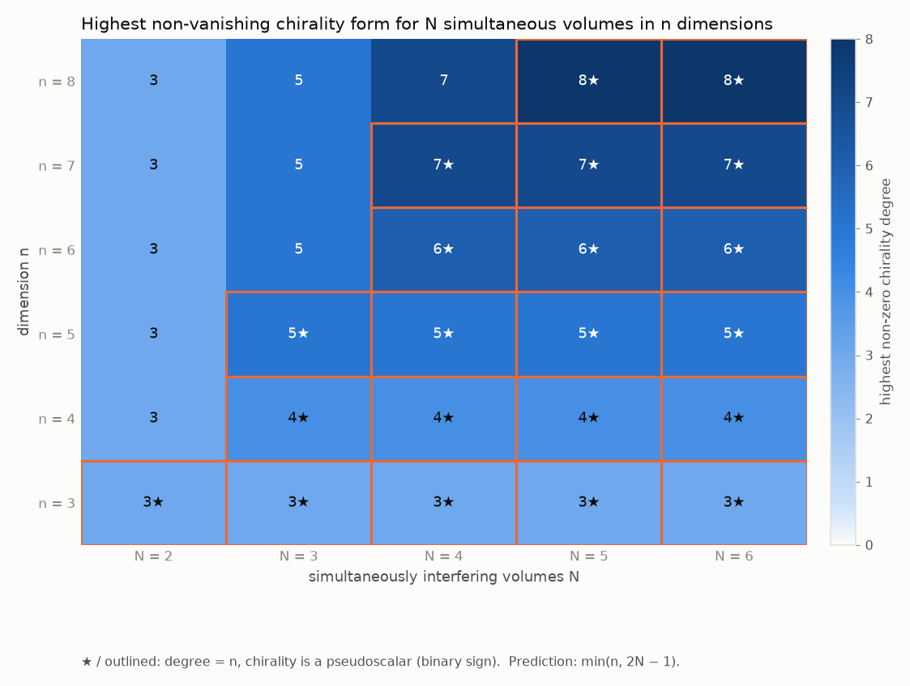

---

## 2. Two volumes: what the interface looks like

### 2.1 Closed forms (exact, verified to $10^{-15}$)

Write $\psi_a=A_a e^{i\varphi_a}$, local wavevectors $k_a=\nabla\varphi_a$,
$h=\ln(|\psi_1|^2/|\psi_2|^2)$ (so the interface is $h=0$) and
$V=\operatorname{sech}(h/2)$. Then, everywhere both fields are non-zero,

$$F=\tfrac12 V^2\;\nabla\ln\!\frac{A_2}{A_1}\wedge(k_2-k_1),\qquad
A\wedge F=\tfrac12 V^2\;k_1\wedge k_2\wedge\nabla\ln\!\frac{A_1}{A_2}.$$

So the **twist plane** is spanned by the interface normal and the fringe
wavevector, and the **chirality 3-vector** is the oriented volume spanned by the
two local wavevectors and the interface normal, weighted by the square of the
fringe visibility. For two single-plane-wave Gaussian volumes of equal width
$\sigma$ this becomes

$$A\wedge F=-\frac{V^2}{2\sigma^2}\,(k_1\wedge k_2)\wedge d ,$$

i.e. (up to the orientation convention of the Berry curvature) the **screw
chirality** $(\log R)\wedge d$ of the configuration: rotate $k_1$ into $k_2$
while advancing along $d$. In 3-D this is the triple product $k_1\cdot(k_2\times d)$,
a sign; in $n\ge4$ it is a decomposable 3-vector, an oriented 3-plane in
$\mathbb R^n$ with a magnitude.

### 2.2 Invariances of the interface

* **Relative phase.** Shifting the phase of one volume moves every fringe but
  leaves $F$ and $A\wedge F$ *exactly* unchanged (measured $10^{-14}$, while the
  intensity pattern changes by ~100 %). The twist-chirality is a property of
  the fringe *geometry*, not of where the fringes sit.
* **Time.** For monochromatic volumes (one frequency each) the whole structure is
  stationary while the fringes stream through it; it evolves only for
  polychromatic volumes or moving envelopes.
* **Flux quantum.** The flux of $F$ through any strip crossing the interface and
  spanning one fringe period is exactly $2\pi$ (half the Bloch sphere).
* **Localisation.** Both $|F|$ and $|A\wedge F|$ follow $\operatorname{sech}^2(h/2)$
  across the interface (measured correlation 0.98); in real space the interface
  has thickness $\sim\sigma^2/|d|$.

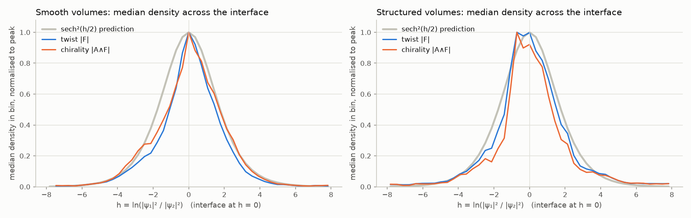

### 2.3 Three dimensions: signed chirality domains on the wall

On the interface, with unit normal $\hat n$ and tangential wavevector
components $k^T_a$, the chirality is $\tfrac12 V^2|\nabla\ln(A_1/A_2)|\;\hat n\wedge k_1^T\wedge k_2^T$.
In 3-D the tangential bivector $k_1^T\wedge k_2^T$ is a sign, so the wall is
tiled by **right- and left-handed domains** separated by curves on which the two
tangential wavevectors are parallel (sign predicted correctly at 100 % of
sampled points).

Two regimes appear:

* *Weakly structured volumes* (a carrier with weak side-bands): one gently wavy
  wall; the screw handedness dominates (82 % of the wall has the screw's sign)
  with small islands of the opposite hand.
* *Strongly structured volumes* (several equal waves): the wall is decorated
  with thin **vortex tubes** around the phase singularities of each volume,
  the domains are balanced (53 / 47 %), and twist and chirality are strongly
  concentrated on the tubes.

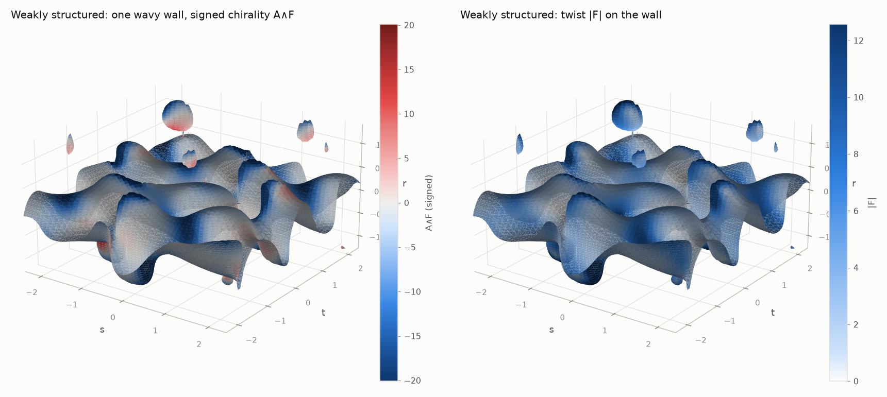
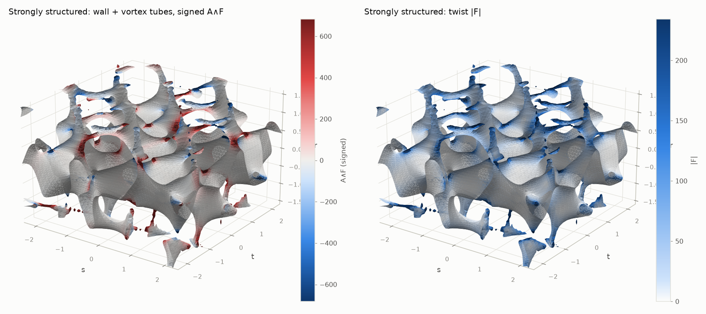
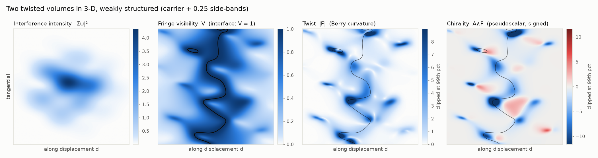

### 2.4 Four dimensions: chirality becomes a direction field

In $n=4$ the Hodge dual $\star(A\wedge F)$ is a vector, and it is **tangent to
the 3-dimensional interface** (measured normal component $10^{-16}$): the
chirality of the interface is a tangent vector field — the axis about which the
tangential wavevector plane turns — not a sign.

* A single-wave pair has a *constant* chirality direction (effective dimension
  1.00) equal to the screw prediction (error $2\times10^{-15}$).
* Structured pairs spread their chirality directions over 2.4 (carrier +
  side-bands), 2.9 (8 random waves) and 3.8 (5 equal waves) of the 4 available
  components.
* A **mirror image** negates the chirality in 3-D (all direction cosines
  exactly $-1$) but merely *rotates* it in 4-D (mean cosine $-0.50$, only 3 %
  of points negated).

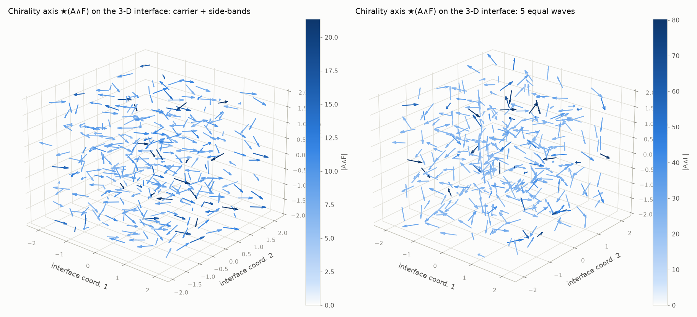
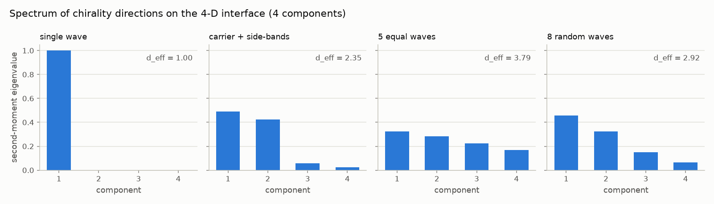
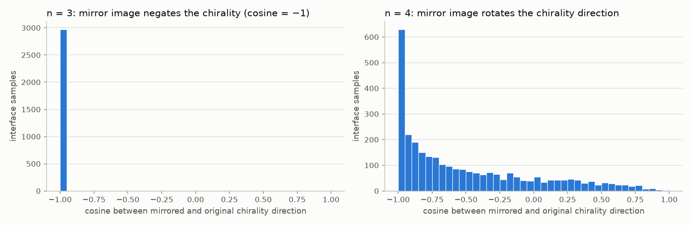

The magnitude of the chirality as a function of the two twist angles of a 4-D
rotation is a smooth landscape with zero lines for the single-wave pair,
$|A\wedge F|=|k_1\wedge R(\alpha_1,\alpha_2)k_1\wedge d|/2\sigma^2$; with
internal structure the landscape is reshaped by the side-bands
(`figures/B_two_volumes_4d_twist_sweep.png`).

### 2.5 Dimension sweep

Effective dimension (participation ratio of the second-moment spectrum) of the
unit chirality 3-vectors sampled on the interface:

| n | components $\binom n3$ | single wave | carrier + side-bands | n+1 equal waves | 2n random waves |
|---|---|---|---|---|---|
| 3 | 1 | 1.0 | 1.0 | 1.0 | 1.0 |
| 4 | 4 | 1.0 | 2.4 | 3.7 | 3.0 |
| 5 | 10 | 1.0 | 4.4 | 8.6 | 5.4 |
| 6 | 20 | 1.0 | 4.8 | 16.7 | 11.5 |
| 7 | 35 | 1.0 | 10.2 | 25.9 | 17.1 |
| 8 | 56 | 1.0 | 10.9 | 36.9 | 26.8 |

Structureless volumes always produce a single oriented 3-plane; internal wave
structure spreads the chirality over an ever larger space as $n$ grows. (The
participation ratio measures linear spread; the decomposable 3-vectors of a
pair lie on a cone of intrinsic dimension $3(n-3)+1$ that nevertheless spans
all $\binom n3$ components.)

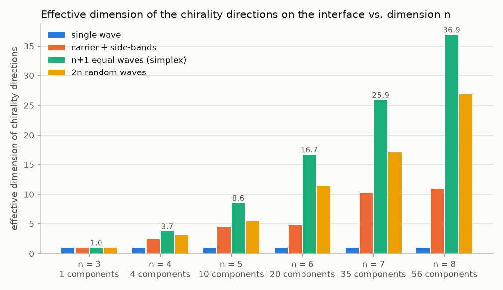

---

## 3. N volumes with simultaneity

With $N$ volumes the dominant-amplitude cells tile space like an "amplitude
Voronoi" diagram: pairwise interfaces (codimension 1) meet at triple junctions
(codimension 2), quadruple junctions, and so on.

**Exact pairwise decomposition of the twist.** With
$\rho_{ab}=\rho_a+\rho_b$,

$$F=\sum_{a<b}\Big(\frac{\rho_{ab}}{\rho}\Big)^{2}F_{ab},$$

where $F_{ab}$ is the twist of the pair $(\psi_a,\psi_b)$ on its own (verified to
$4\times10^{-16}$). Every $F_{ab}$ has rank 2, so $F_{ab}\wedge F_{ab}=0$ and

$$F\wedge F=2\sum_{(ab)<(cd)} w_{ab}\,w_{cd}\,F_{ab}\wedge F_{cd},\qquad w_{ab}=(\rho_{ab}/\rho)^2 ,$$

is made *purely* of cross terms between different pairs — each involving at
least three volumes. The twist is pairwise additive; the second Chern density
(and every higher rung) is irreducibly multi-body. Pairwise interference can
never produce it: it exists only where three or more volumes interfere
*simultaneously*, and numerically it is confined to the triple junction (it
falls to 1 % of its peak within a distance ~0.75 of the junction while $|F|$
is still at 20–30 %).

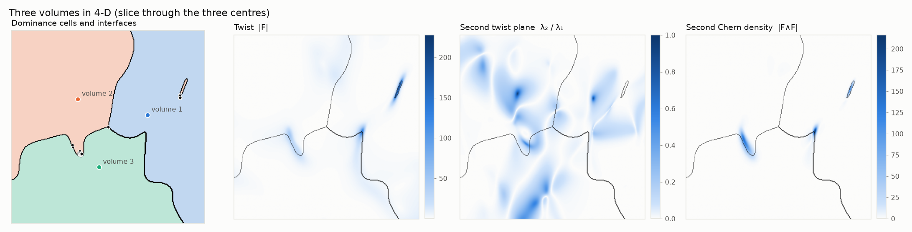
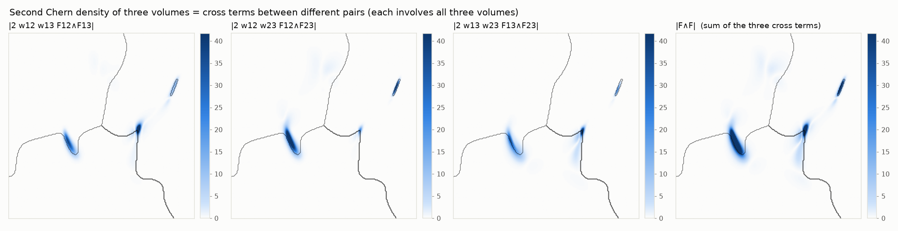
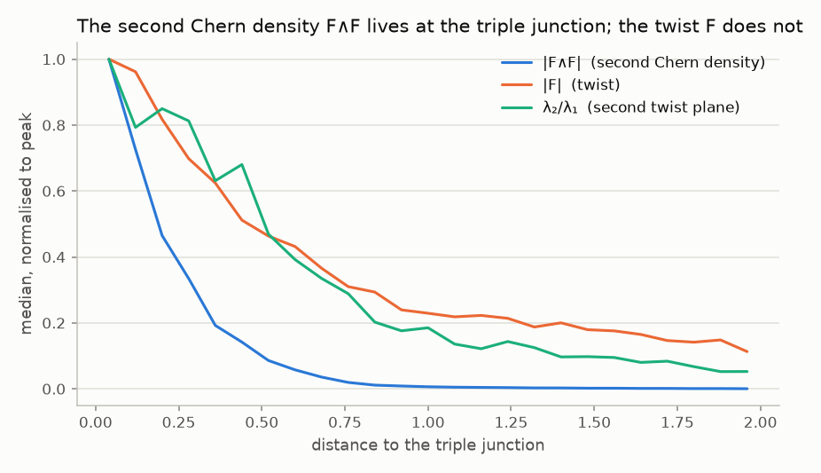

Simultaneity in time: three non-dispersive packets converging on a point in
4-D. The projective density $|F\wedge F|$ sits at the junction of the dominance
cells at all times, but its intensity-weighted counterpart $\rho|F\wedge F|$
grows by four orders of magnitude between separated and fully overlapping
packets — three-body chirality is physically present only while all three
overlap at once.

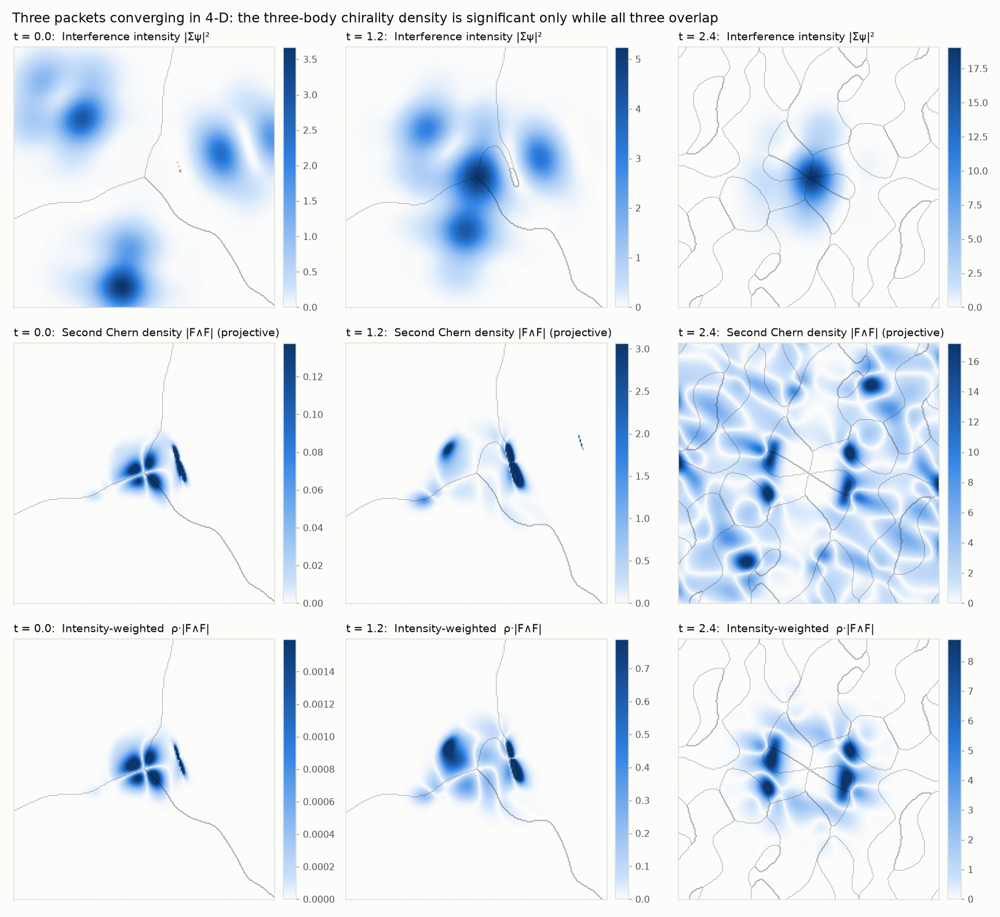

---

## 4. Caveats, honestly stated

* The geometric quantities are **projective**: they see the interference
  geometry even where all fields are exponentially small. Use the
  intensity-weighted densities $\rho|F|$, $\rho|A\wedge F|$, … (available
  everywhere in the library) when physical significance matters.
* Keeping the volumes' identities (the spinor) is a modelling choice. It is the
  right one for distinguishable channels and for any question about an
  *interface between* volumes; the summed scalar field alone carries no
  helicity-type chirality (§1.2).
* The sign of $A\wedge F$ follows the standard Berry-curvature orientation and is
  *opposite* to the geometric screw $(k_1\wedge k_2)\wedge d$; magnitudes and
  oriented planes are convention-free.
* "Effective dimension" is a participation ratio of directions, not an intrinsic
  manifold dimension.

---

## 5. Using the library

```bash
pip install numpy scipy matplotlib scikit-image pytest
python -m pytest -q tests            # 47 tests
cd experiments && python run_all.py  # regenerates figures/ and results/
```

```python
import numpy as np
import twistchiral as tc

# two volumes in 5-D: a simplex wave set, twisted in two planes, displaced by d
S = tc.twisted_pair(n=5, kind="simplex", k_scale=3.0, angles=[0.5, 1.1],
                    displacement=[0.4, 0.2, 0.9, 0.1, 0.6], width=1.0, amplitudes=0.25)

samp = tc.sample_interface(S, count=4000, rng=0)          # points on |psi_1| = |psi_2|
q = tc.geometry_at(S, samp["X"])                          # A, g, F and the chirality ladder
C3 = q["ladder"][3]                                       # A^F, shape (P, C(5,3)) = (P, 10)
print(tc.direction_spectrum(C3)["effective_dimension"])   # how many directions the chirality explores

# closed form check and the screw prediction
an = tc.analytic_two_volume_chirality(S, samp["X"])
assert np.allclose(C3, an["C3"])

# many volumes: rotation planes of the twist and the ladder
S3 = tc.cluster(n=4, N=3, kind="simplex", spacing=1.7, rng=0)
J = tc.sample_junction(S3, (0, 1, 2), count=3000, rng=0)["X"]
rates, frames = tc.rotation_planes(tc.geometry_at(S3, J)["F"])   # two rotation planes at the junction
print(tc.ladder_existence(S3, J))                                  # max degree 4 = min(4, 2*3-1)
```

Module map:

| module | contents |
|---|---|
| `twistchiral/waves.py` | `WaveVolume`, `WaveSystem` — analytic fields and gradients, rigid motions, phases, time |
| `twistchiral/geometry.py` | wavevector polytopes, $\mathrm{SO}(n)$ rotations and their planes, reflections, screw chirality |
| `twistchiral/exterior.py` | batched exterior algebra: wedge, Hodge star, interior product, norms |
| `twistchiral/qgt.py` | Berry connection, quantum metric, twist $F$, chirality ladder, rotation planes, pairwise decomposition |
| `twistchiral/interface.py` | Newton / Gauss–Newton sampling of interfaces and junctions, dominance cells, Bloch data |
| `twistchiral/analysis.py` | closed forms, direction spectra, localisation profiles, invariance and mirror tests, ladder scans |
| `twistchiral/slices.py`, `viz.py`, `style.py` | 2-/3-D slicing, marching-cubes interfaces, all figures |
| `experiments/` | the four studies (`two_volumes_3d`, `two_volumes_4d`, `dimension_sweep`, `n_volumes`) |
